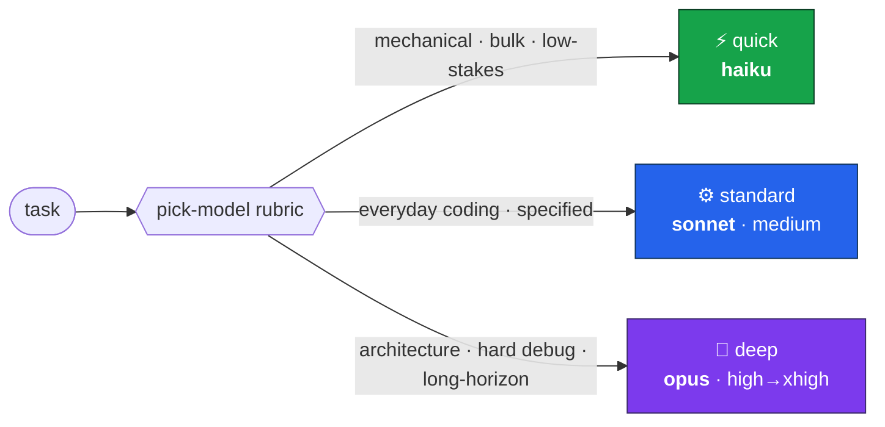

<div align="center">

# 🧭 model-router

### Route every task to the *cheapest Claude model that still nails it* — automatically.

[](https://docs.claude.com/en/docs/claude-code)
[](#-the-tiers)
[](#-claude-route--the-per-launch-cli)
[](LICENSE)

</div>

---

Opus on a mechanical rename is wasted money and latency. Haiku on an architecture decision is a
confident wrong answer. **model-router** picks the right tier for each task — and *acts on it*:
it delegates self-contained sub-work to model-pinned subagents, and tells you which `/model` to
switch to for the main thread.

> A Claude Code plugin **+** a `claude-route` CLI **+** a map of every model-selection lever.

## ✨ At a glance



## 🎯 The tiers

Everything uses the **aliases** `haiku` / `sonnet` / `opus` — each always resolves to the
*latest* model in its tier, so nothing is ever pinned to a stale version.

| | Tier | alias · subagent | Relative cost | Best for |
|:-:|---|---|:-:|---|
| ⚡ | **Quick** | `haiku` · `quick` | `$` | mechanical, deterministic, low-stakes, high-volume |
| ⚙️ | **Standard** | `sonnet` · `standard` | `$$` | everyday coding, moderate reasoning, well-specified |
| 🧠 | **Deep** | `opus` · `deep` | `$$$` | architecture, hard/underspecified debugging, review, long-horizon |

`opus` is Claude Code's default main model — route *down* to save cost/latency, *up* when the
work genuinely needs it. Effort is a second, orthogonal lever (`medium` on standard, `high`→
`xhigh` on deep; `xhigh` is the ceiling — no fast mode).

## 🚀 Install

```bash
# 1. register this repo as a plugin marketplace
claude plugin marketplace add jpfmscel/model-router

# 2. install the plugin
claude plugin install model-router@jpfmscel

# 3. verify, then start a new session (skills/agents load at session start)
claude plugin list
```

<details>
<summary>Other ways in</summary>

| Goal | Command |
|---|---|
| **From a local clone** (works even if the repo is private) | `claude plugin marketplace add /path/to/model-router` → `claude plugin install model-router@jpfmscel` |
| **Try it for one session** | `claude --plugin-dir /path/to/model-router` |
| **No plugin system** | copy `skills/pick-model`, `agents/*.md`, `commands/pick-model.md` into `~/.claude/{skills,agents,commands}/` |

</details>

Then, in a new session:

```
/pick-model design a caching layer for the API      →  🧠 deep
/pick-model rename userId to accountId everywhere    →  ⚡ quick
```

…and Claude will auto-delegate mechanical / everyday / hard sub-work to the matching subagent
as it goes.

## 🧠 How routing works (the honest version)

One constraint shapes the whole design: **nothing inside a plugin can switch the _main_
session's model.** `/model` is a user action; hooks can't route models; a skill's `model:`
frontmatter only overrides the current turn. The one lever a plugin *does* control is
**subagents**. So model-router makes exactly two moves:

- **🔀 Delegate** — the work is a self-contained sub-task → dispatch the matching subagent
  (`quick` / `standard` / `deep`). That sub-task genuinely runs on the chosen model.
- **🗣️ Advise** — the *whole session* belongs on another tier → recommend the `/model <tier>` to
  run. It can't switch the main model for you.

## 🗺️ The four selection layers

Coarse (one setting for everything) → fine (per sub-task). Use the coarsest one that does what
you want.

| Scope | Where | Effect |
|---|---|---|
| 🌍 **Global default** | `~/.claude/settings.json` → `"model"` | one model for *all* new sessions (`/model` → "save as default") |
| 📁 **Per-project** | `<repo>/.claude/settings.json` → `"model"` | coarse routing by repo |
| 🖥️ **Per-launch** | `claude --model <alias>` · [`claude-route`](#-claude-route--the-per-launch-cli) | pick when you start a session / run a headless task |
| 🧵 **In-session** | this plugin's `quick`/`standard`/`deep` subagents | route delegated sub-work without touching the main session |

Precedence, highest wins: `--model` flag → `--settings` → project `settings.json` → user
`settings.json` → built-in default.

> **A single global default is not routing** — it's one model for everything. Per-task selection
> needs the per-launch CLI or the in-session subagents. If you just want *"always use X"*, set
> the global `model` key and skip the plugin entirely.

## 🧪 `claude-route` — the per-launch CLI

[`bin/route.sh`](bin/route.sh) classifies a task (cheaply, with `haiku`) and launches Claude Code
on the chosen tier via `claude --model` + `--effort`. It controls the model **at invocation
time** — it can't change a session already running (that's what the subagents are for).

```bash
claude-route "rename userId to accountId across the repo"   # → quick, launches a session
claude-route -p "summarize the last commit"                 # → headless answer, printed
claude-route -t deep "design a caching layer for the API"   # force a tier
claude-route -n "add a null check in parse()"               # dry-run: just show the pick
```

Flags: `-t/--tier` · `-p/--print` (headless) · `-n/--dry-run` · `--classifier-model` · `-h/--help`.

Wire it onto your `PATH` (named `claude-route` to avoid the macOS `/sbin/route` clash):

```bash
ln -sf "$(pwd)/bin/route.sh" /opt/homebrew/bin/claude-route   # or any dir on your PATH
```

## 🪝 Auto-routing on every prompt

A `UserPromptSubmit` hook ([`hooks/pick-model-trigger.sh`](hooks/pick-model-trigger.sh)) runs on
**every prompt** and injects one directive: *"use the `pick-model` skill to route this."* The
**skill's full rubric** — not a keyword guess — then picks the tier and acts on it. The hook
itself just prints a fixed string (no LLM call, no deps, nothing to break); the intelligence
lives in the skill.

The injected directive tells the skill to route **quietly** (no narration unless it actually
delegates or recommends `/model`) and to **skip trivial prompts** (greetings, confirmations).

> **A hook cannot switch the model.** Claude Code exposes no such lever. The skill acts on its
> pick by delegating a self-contained sub-task to the matching subagent, or recommending
> `/model` for the whole session.

Silence it by disabling the plugin's hooks, or remove the `hooks` block from
`.claude-plugin/plugin.json`.

## 📐 The routing rubric

| Signals | Tier |
|---|---|
| mechanical, deterministic, low-stakes, high-volume | ⚡ `quick` (haiku) |
| well-specified everyday coding, moderate reasoning, bounded scope | ⚙️ `standard` (sonnet · medium) |
| architecture, cross-cutting, hard/underspecified debugging, security, review, long-horizon | 🧠 `deep` (opus · high→xhigh) |

**Tie-breakers:** high cost-of-error bumps **up** a tier · cost-sensitive + reversible + bulk
starts **down** and escalates on failure · genuinely unsure → pick the higher tier once (a wrong
cheap answer usually costs more than the tier difference) · reach for the **effort** lever before
the model lever on borderline tasks.

Full rubric: [`skills/pick-model/SKILL.md`](skills/pick-model/SKILL.md).

## 🧩 What's inside

```
model-router/
├── .claude-plugin/
│   ├── plugin.json            plugin manifest
│   └── marketplace.json       makes the repo installable via /plugin
├── skills/pick-model/SKILL.md the decision rubric
├── agents/
│   ├── quick.md               model: haiku
│   ├── standard.md            model: sonnet · effort medium
│   └── deep.md                model: opus   · effort high
├── commands/pick-model.md     /pick-model <task>
├── hooks/pick-model-trigger.sh  fires the pick-model skill on every prompt (UserPromptSubmit)
└── bin/route.sh               claude-route — per-launch CLI
```

## 🔄 Updating

```bash
claude plugin marketplace update jpfmscel && claude plugin install model-router@jpfmscel
# (local-clone install instead: `git pull` then `claude plugin marketplace update`)
```

## 📄 License

[MIT](LICENSE) — do whatever, no warranty.
